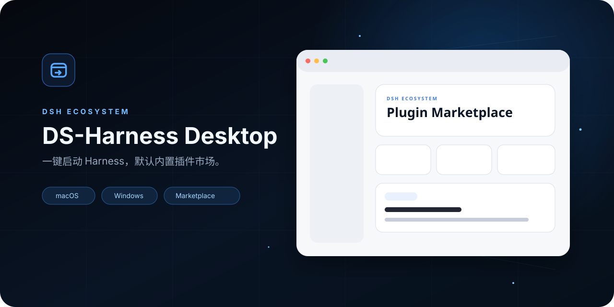
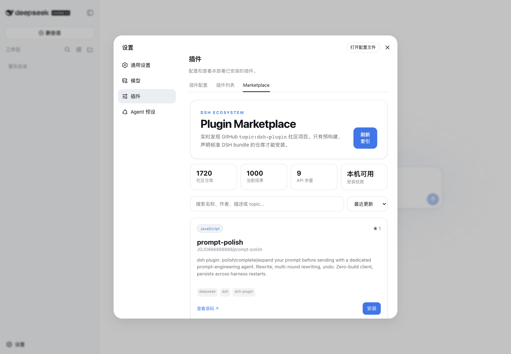

<p align="center"></p>
<p align="center"><a href="README.md">简体中文</a> · <a href="README.en.md">English</a> · <a href="https://ouyangyipeng.github.io/dsh-desktop/">Website</a> · <a href="https://github.com/ouyangyipeng/dsh-desktop/releases/latest">Download</a> · <a href="https://github.com/ouyangyipeng/dsh-marketplace">Marketplace</a></p>

# DS-Harness Desktop

DS-Harness Desktop packages the official DeepSeek Harness Web experience as an installable macOS and Windows application. Download a DMG or EXE and launch it without Git, Node.js, pnpm, a startup command, or a separate browser.

> This is unofficial, community-maintained software, not a DeepSeek release. Harness remains the source of the runtime, Web UI, and plugin system.



## v0.2.0

- one-click standard `dsh web` startup;
- offline bundled [dsh-marketplace v0.1.1](https://github.com/ouyangyipeng/dsh-marketplace/releases/tag/v0.1.1);
- DSH-native light and dark Marketplace surfaces;
- isolated data, loopback-only serving, readiness probes, process-tree shutdown, redacted diagnostics, and recovery;
- build metadata for Desktop, official Harness, and Marketplace commits.

## Install and trust

Download the matching artifact from [Releases](https://github.com/ouyangyipeng/dsh-desktop/releases/latest). Builds are currently unsigned and not notarized. On macOS, approve only this app through Privacy & Security if Gatekeeper blocks first launch. On Windows, compare `SHA256SUMS` before using SmartScreen's normal review flow. Never disable operating-system security globally.

Desktop bundles the marketplace tool, not trust in every listed plugin. Community plugins run with Harness host privileges. Review source, maintenance, license, and releases before installing. Marketplace blocks repository lifecycle scripts during installation and accepts only prebuilt standard DSH bundles; this is not an official audit.

Desktop launches `dsh web --patch <desktop-owned-overlay> --host 127.0.0.1 --port 0`. Installed applications never `git pull` the pinned runtime; updates move through verified Desktop releases.

## Develop

```bash
git clone --recursive https://github.com/ouyangyipeng/dsh-desktop.git
cd dsh-desktop
pnpm install --frozen-lockfile
pnpm upstream:bootstrap
pnpm build
pnpm runtime:stage -- --development
pnpm test
pnpm site:check
pnpm run pack -- --development --mac --arm64
```

See [Architecture](docs/architecture.md), [Development](docs/development.md), and [Releasing](docs/releasing.md). The shell is Apache-2.0; bundled components retain their licenses in [THIRD_PARTY_NOTICES.md](THIRD_PARTY_NOTICES.md).
