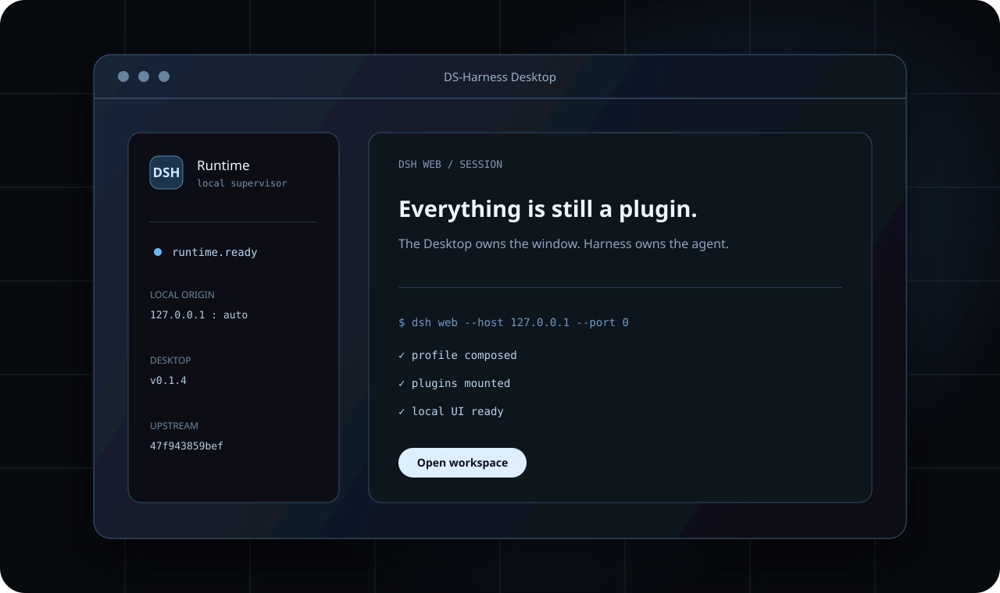

# DS-Harness Desktop

**DS-Harness Desktop** (`dsh-desktop`) packages the official [DeepSeek Harness](https://github.com/deepseek-ai/deepseek-harness) Web experience as a native desktop application for macOS and Windows. It starts an isolated local Harness runtime, waits until that runtime is healthy, and opens the exact loopback origin in a hardened Electron window.

> This is an unofficial, community-maintained project. It is not an official DeepSeek release. DeepSeek Harness remains the upstream runtime and source of product behavior.



[Download the latest release](https://github.com/ouyangyipeng/dsh-desktop/releases/latest) · [Product site](https://ouyangyipeng.github.io/dsh-desktop/) · [中文说明](README.zh.md) · [dsh-plugin community](https://github.com/topics/dsh-plugin)

## Why this project exists

The upstream Harness development flow is intentionally repository-oriented: clone the source, run commands, then open its browser UI. DS-Harness Desktop adds a small distribution and lifecycle layer around that official runtime:

- one app icon instead of a terminal command and manually opened browser;
- an embedded, version-pinned Harness runtime with no first-run clone;
- a supervised `dsh web` process bound to `127.0.0.1` on an operating-system-selected port;
- startup recovery with redacted diagnostics and log access;
- separate checks for Desktop releases and newer official Harness revisions;
- traceable build identity for both the Desktop commit and upstream Harness commit.

It does not fork Harness behavior into a second implementation. The official repository is a Git submodule at `upstream/deepseek-harness`, and every installer records the exact upstream commit it contains.

## Install

### macOS

1. Download the `.dmg` matching your Mac architecture from [Releases](https://github.com/ouyangyipeng/dsh-desktop/releases/latest).
2. Open the disk image and drag **DS-Harness Desktop** to **Applications**.
3. Because early community builds are not notarized, macOS may require you to approve the app once in **System Settings → Privacy & Security** before opening it again.

### Windows

1. Download the `.exe` matching your PC architecture from [Releases](https://github.com/ouyangyipeng/dsh-desktop/releases/latest).
2. Run the installer and choose an installation directory.
3. Because early community builds are unsigned, Microsoft Defender SmartScreen may show the publisher as unknown. Inspect the release checksum and use SmartScreen's normal review flow only if you trust this repository and artifact.

Unsigned builds require an extra confirmation. This project does not ask users to disable Gatekeeper, SmartScreen, antivirus, or operating-system security controls.

## Runtime and data

The application starts its bundled `@deepseek-ai/dsh` CLI as:

```text
dsh web --host 127.0.0.1 --port 0
```

The renderer loads only after the child announces a valid loopback URL and an HTTP readiness probe succeeds. Desktop assigns an isolated `DSH_HOME` below Electron's per-user application data directory, so it does not modify a separate CLI checkout or its Harness home. Existing Harness credential and provider behavior is unchanged; see the [official Harness documentation](https://github.com/deepseek-ai/deepseek-harness#readme) for runtime configuration.

Use **DS-Harness Desktop → About DS-Harness Desktop** to inspect the application version, Desktop commit, bundled upstream commit, and build target. Use **Open Logs Folder** if startup recovery asks for diagnostics.

## Updates

Two update checks are deliberately separate:

- **Check for Updates…** checks published `dsh-desktop` releases and can open a verified release page.
- **Check Harness Updates…** compares the bundled upstream commit with the official Harness default branch and can open the official commit page.

The second check never runs `git pull` inside an installed app. A newer upstream revision enters an installer only after the submodule update, build, tests, runtime staging, and target-native packaging checks pass in this repository. This keeps installed application contents immutable and reproducible.

## Develop

Requirements: Git, Node.js `^22.19.0 || >=24.0.0`, and pnpm `11.21.0`.

```bash
git clone --recursive https://github.com/ouyangyipeng/dsh-desktop.git
cd dsh-desktop
pnpm install --frozen-lockfile
pnpm upstream:bootstrap
pnpm dev
```

Useful commands:

```bash
pnpm upstream:status
pnpm upstream:update
pnpm build
pnpm test
pnpm site:check
pnpm runtime:stage -- --development
pnpm pack -- --development --mac --arm64
```

Packaging is target-native: macOS installers are built on macOS, and Windows installers are built on Windows. See [Development](docs/development.md), [Architecture](docs/architecture.md), and [Releasing](docs/releasing.md) before changing staging or release behavior.

## Repository roles

```text
src/main/                 Desktop lifecycle, security, recovery, and update checks
scripts/                  Upstream, staging, packaging, and validation commands
site/                     Static GitHub Pages product site
tests/                    Unit, integration, snapshot, and policy tests
upstream/deepseek-harness Official Harness source pinned as a Git submodule
```

The Desktop shell is a distribution companion rather than an in-process Harness plugin. Harness remains plugin-based internally; this repository stays outside that plugin graph so it can supervise startup, process ownership, installer updates, and recovery even when the Harness runtime cannot load.

## Security and verification

- Renderer sandboxing and context isolation stay enabled; Node integration and WebView attachment are disabled.
- Navigation is limited to the exact runtime origin. Approved HTTPS links open in the system browser.
- Renderer permissions and downloads are denied by default.
- Runtime diagnostics are bounded and credential-like text is redacted before recovery rendering or clipboard copy.
- Release artifacts publish SHA-256 checksums. Compare the downloaded file with `SHA256SUMS` before approving an unsigned build.

Please report security-sensitive issues privately to the repository owner instead of publishing credentials or raw diagnostic logs in an issue.

## License

DS-Harness Desktop is licensed under [Apache License 2.0](LICENSE). The vendored or staged upstream components retain their own licenses and notices; see [THIRD_PARTY_NOTICES.md](THIRD_PARTY_NOTICES.md).
