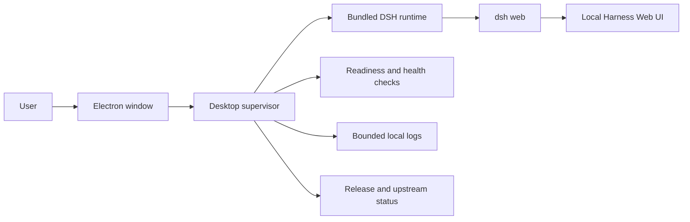

# DS-Harness Desktop standalone repository design

## Status

Approved for implementation on 2026-08-14.

## Goal

DS-Harness Desktop (`dsh-desktop`) is an independently versioned desktop launcher and runtime supervisor for [DeepSeek Harness](https://github.com/deepseek-ai/deepseek-harness). A user installs a DMG or EXE, launches the application, and receives the standard local Harness Web UI without cloning a repository or entering startup commands.

The Desktop repository has a new Git history, its own README, product website, releases, tests, and visual identity. The official Harness repository remains an immutable, SHA-pinned upstream dependency.

## Product boundaries

The Desktop application owns Electron lifecycle management, packaged-runtime discovery, subprocess supervision, readiness checks, logs, error recovery, update discovery, build metadata, packaging, and the native window.

The upstream Harness owns the agent, agent loop, LLM providers, plugins, sessions, configuration semantics, and Web UI. Desktop starts the upstream `dsh web` entry point and does not fork these capabilities or import upstream TypeScript source into the Desktop build.

Desktop is compatible with the Harness plugin model because it hosts the assembled upstream application. It is not itself an in-process Harness plugin: process startup, native window management, installation, and binary updates exist outside the Harness runtime lifecycle.

## Repository layout

```text
dsh-desktop/
├── README.md
├── README.zh.md
├── LICENSE
├── THIRD_PARTY_NOTICES.md
├── ROADMAP.md
├── package.json
├── pnpm-lock.yaml
├── src/
│   ├── main/
│   ├── preload/
│   ├── renderer/
│   └── shared/
├── assets/
├── scripts/
├── tests/
├── site/
├── docs/
├── plan/
├── upstream/
│   └── deepseek-harness/
└── .github/workflows/
```

`upstream/deepseek-harness/` is a Git submodule whose URL is the official repository and whose recorded commit is the sole source version used by a build. Desktop files never modify the submodule working tree. A build rejects an uninitialized, dirty, unexpected, or unrecorded submodule state.

## Runtime architecture



The installed application contains a staged, immutable Harness runtime built from the recorded submodule commit. It does not require the user to install Git, Node.js, or pnpm.

The main process selects an available loopback port, starts `dsh web` as a child process, captures bounded stdout and stderr, and waits for an explicit readiness result. The BrowserWindow loads the loopback URL only after readiness succeeds. Startup timeouts, premature exits, missing runtime files, and port conflicts produce actionable diagnostics with the failed command role, log location, and retry action.

The supervisor owns the process tree it starts. Application exit terminates that process tree with a bounded graceful period followed by platform-appropriate forced termination. The supervisor never kills a process solely because it uses a desired port or has a matching executable name.

The renderer receives only typed, allowlisted operations through the preload bridge. Node integration remains disabled, context isolation remains enabled, navigation outside the local application is blocked, and approved external links open through the operating system.

## Build and staging

The root project builds the Electron application independently. It does not add the Desktop project to the upstream pnpm workspace and does not rely on workspace symlinks in a distributable artifact.

The build commands have the following responsibilities:

- `pnpm upstream:status` reports the pinned and official default-branch commits without modifying the repository.
- `pnpm upstream:update` advances the submodule commit and runs compatibility checks, but never commits, pushes, or publishes.
- `pnpm upstream:bootstrap` initializes and verifies the submodule, installs the pinned upstream dependencies, and builds the required upstream artifacts.
- `pnpm runtime:stage` creates the relocatable runtime, restores required production peers, rejects development-machine symlinks, and writes build metadata.

The Desktop project owns a zero-dependency bounded log-tail helper. It does not import `@deepseek-ai/dsh-output-retention` or any other upstream workspace source package merely to compile the supervisor.

Every packaged artifact records:

```json
{
  "desktopVersion": "0.1.1",
  "desktopCommit": "<full SHA>",
  "upstreamRepository": "https://github.com/deepseek-ai/deepseek-harness.git",
  "upstreamCommit": "<full SHA>",
  "targetPlatform": "<platform>",
  "targetArch": "<architecture>"
}
```

The About and Updates views read this packaged metadata instead of inferring version identity from a development checkout.

## Update model

Installed applications update through stable `ouyangyipeng/dsh-desktop` GitHub Releases. The first unsigned release line checks for an update, displays release notes and the bundled Harness commit, downloads or opens the correct installer, and leaves installation to the operating system. Silent replacement remains disabled until release signing and platform-specific verification are available.

Installed applications do not run `git pull` against their bundled runtime. Pulling source would introduce undeclared Git, Node.js, pnpm, compiler, network, and compatibility requirements. Fast upstream adoption is provided by an automated upstream-check workflow that proposes a submodule update, runs compatibility tests, and creates a reviewable pull request. A stable Desktop release then distributes the verified upstream runtime.

The Updates view distinguishes Desktop releases from upstream Harness status. It displays the current Desktop version, current Harness commit, latest verified Desktop release, and whether the official Harness default branch contains newer commits.

## GitHub automation

`verify.yml` checks formatting, types, focused unit tests, Desktop builds, submodule identity, runtime relocation, metadata, and an installed-artifact smoke path.

`release.yml` builds release artifacts from tags. macOS produces an Apple Silicon DMG. Windows produces ARM64 and x64 installers on native target runners. A Windows ARM64 Parallels VM supplies manual ARM64 evidence; it does not substitute for Windows x64 CI. Releases include `SHA256SUMS.txt`, build metadata, first-run instructions, and known unsigned-application warnings.

`pages.yml` publishes the static product site and verifies its internal links and release URLs.

`upstream-check.yml` periodically compares the submodule commit with the official default branch. A change updates a dedicated branch, runs the normal compatibility checks, and opens or refreshes one pull request. It never writes directly to the default branch and never publishes a release.

## README and product website

`README.md` is the English product entry point and links to `README.zh.md`. Both documents provide download links, a product preview, features, installation warnings, architecture, upstream traceability, development commands, security behavior, license information, and a conspicuous non-official-project notice.

The GitHub Pages site is a product and download landing page rather than a copy of the upstream documentation site. It presents the application preview, platform downloads, checksums, architecture, Desktop version, Desktop commit, bundled Harness commit, repository link, and official upstream link.

The visual system is named **Midnight Particle**. It uses an original DSH monogram, near-black background, low-saturation blue-gray fog, sparse particles, a restrained grid, and a translucent Desktop window preview. It references the atmosphere of the [official Harness website](https://www.deepseek.com/harness/) without copying its logo, images, video, source assets, or layout. Motion uses a lightweight Canvas implementation and honors `prefers-reduced-motion`; the content and download controls remain usable without Canvas or JavaScript animation.

## Repository identity and migration

The public repository is `ouyangyipeng/dsh-desktop`, has an independent root commit, and uses `main` as its default branch. Its description is “Desktop launcher and runtime supervisor for DeepSeek Harness.” Its topics include `dsh-plugin`, `deepseek-harness`, `desktop-app`, `electron`, `macos`, and `windows`.

The existing fork is renamed to `dsh-desktop-upstream-archive` before the independent repository claims the `dsh-desktop` name. The archive retains the existing `desktop-v0.1.0` tag and release until the new repository, Pages site, and `desktop-v0.1.1` release are verified. Migration does not delete the archive.

The local official Harness checkout remains intact. The standalone Desktop checkout ultimately lives at `/Users/bytedance/proj/experiment/dsh-desktop`.

## License, attribution, and credentials

Desktop-owned source uses Apache-2.0. `THIRD_PARTY_NOTICES.md` identifies the official Harness repository, its pinned source mechanism, Electron, and other material runtime dependencies. Product pages and the About view state that this is a community-maintained, unofficial desktop application.

Desktop does not collect or transmit API keys. It passes configuration to the local Harness runtime through documented upstream mechanisms and never writes credentials into build metadata, logs, command arguments, release assets, or Git history. Diagnostic rendering redacts known credential fields before displaying or exporting logs.

## Failure behavior

The application fails with a recoverable status page instead of a blank window when the runtime is missing, exits early, exceeds the readiness timeout, or cannot bind a safe loopback address. The status page exposes retry, copy redacted diagnostics, open logs, open installation help, and quit actions.

Builds fail before packaging when the submodule is dirty or uninitialized, the upstream build fails, required runtime peers are absent, staged files contain development symlinks, metadata disagrees with Git state, or the staged runtime smoke test fails.

## Release acceptance

A release is acceptable when all of the following are true:

- The standalone repository has no official Harness Git ancestry and records the official source only through the submodule.
- A clean clone can initialize, build, stage, and package using documented commands.
- The DMG launches from a read-only mounted image and reaches the standard local Harness UI.
- Windows ARM64 and x64 packages reach the same UI on their native target systems.
- Quitting leaves no Desktop-owned Harness process tree.
- Startup failures expose actionable, redacted diagnostics and a retry path.
- About, Pages, release notes, and packaged metadata agree on both Git commits.
- Update checks target the independent repository and select the correct platform artifact.
- README and Pages identify the project as unofficial and link the official upstream repository.
- Release assets publish matching SHA-256 checksums.

## Deferred capabilities

Apple notarization, macOS Developer ID signing, Windows Authenticode signing, silent in-place updates, Intel macOS builds, and automatic merging of upstream updates require separate decisions and credentials. Their absence must remain visible in installation and release documentation.
